<!-- ░░ HRISHIKESH GAVAI ░░ wheatpaste edition ░░ assets/ lives next to this file ░░ -->

<div align="center">




<br/>

<a href="https://unsplash.com/photos/GXZ-W2__ebM"></a>
<a href="https://unsplash.com/photos/v5OiDiqIj-M"></a>
<a href="https://unsplash.com/photos/00WhXHKB_yM"></a>

<br/><br/>

<a href="https://github.com/Hrishikesh-Gavai"></a>

<br/><br/>

<picture>
  <source media="(prefers-color-scheme: dark)" srcset="assets/divider-dark.svg"/>
  
</picture>

<br/><br/>


</div>

```js
const hrishikesh = {
  role:      ["Full Stack Developer", "AI Engineer"],
  studying:  "Computer Engineering @ KKWIEER, Nashik",
  canvas:    ["the web", "3D", "game engines", "neural nets"],
  currently: "building the future... one commit at a time",
  motto:     "code • create • conquer",
};
```

<div align="center">

<a href="https://unsplash.com/photos/uymG7UVPXpI"></a>

<br/><br/>

<picture>
  <source media="(prefers-color-scheme: dark)" srcset="assets/divider-dark.svg"/>
  
</picture>

<br/><br/>


<br/><br/>

<br/>


<br/><br/>

<br/>


<br/><br/>

<br/>


<br/><br/>

<br/>


<br/><br/>

<br/>


<br/><br/>

<br/>


<br/><br/>

<a href="https://unsplash.com/photos/ISMmYTfr2ts"></a>

<br/><br/>

<picture>
  <source media="(prefers-color-scheme: dark)" srcset="assets/divider-dark.svg"/>
  
</picture>

<br/><br/>


<br/><br/>


<br/><br/>

<picture>
  <source media="(prefers-color-scheme: dark)" srcset="assets/divider-dark.svg"/>
  
</picture>

<br/><br/>


<br/>


<br/><br/>

<a href="https://unsplash.com/photos/K0cW669UQH0"></a>
<a href="https://unsplash.com/photos/6Fb8hLjRqVw"></a>
<a href="https://unsplash.com/photos/cLjPDgBSsFM"></a>
<a href="https://unsplash.com/photos/XyDUj57VzFM"></a>

<br/><br/>



<sub>
photos via <a href="https://unsplash.com">Unsplash</a> —
<a href="https://unsplash.com/@jaredmurray">Jared Murray</a>,
<a href="https://unsplash.com/@jdent">Jason Dent</a>,
<a href="https://unsplash.com/@ormoney">Kate Kopteva</a>,
<a href="https://unsplash.com/@maxvdo">Max van den Oetelaar</a>,
<a href="https://unsplash.com/@svi_designs">Sergi Viladesau</a>,
<a href="https://unsplash.com/@diofagundes">Diogo Fagundes</a>,
<a href="https://unsplash.com/@anniespratt">Annie Spratt</a>,
<a href="https://unsplash.com/@thoutbox">Yonghyun Lee</a>,
<a href="https://unsplash.com/@pawel_czerwinski">Pawel Czerwinski</a>
</sub>

</div>
